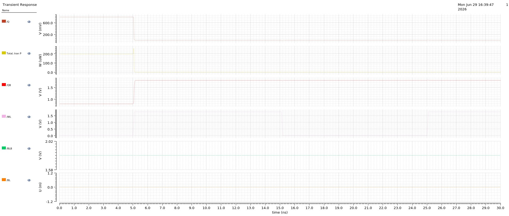
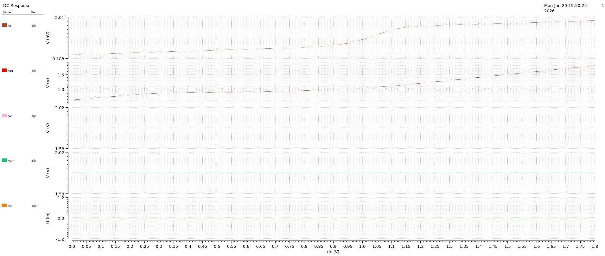
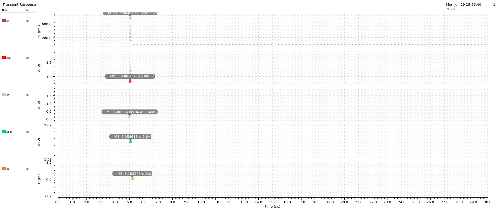
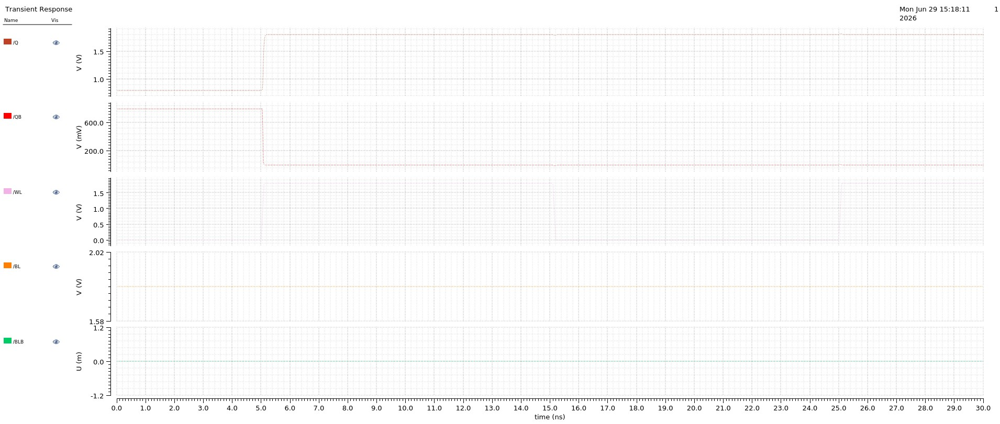

# 6T SRAM Simulation Waveforms

This document presents the main simulation waveforms obtained during the
analysis of the 6T SRAM cell in Cadence Virtuoso.

------------------------------------------------------------------------

## 1. Write '0' Operation and Power Response

The transient response verifies the **Write '0' operation**. With **BL =
0 V** and **BLB = 1.8 V**, the storage nodes settle to **Q = 0** and
**QB = 1** during the write operation.

The power waveform shows the power consumed during SRAM switching and
the change in power near the write event.

------------------------------------------------------------------------

## 2. DC Analysis

The DC analysis studies the static response of the SRAM cell as the
swept DC voltage varies from **0 V to 1.8 V**. The variation of **Q and
QB** represents the voltage and switching behavior of the storage nodes.

This analysis helps evaluate the DC characteristics of the SRAM cell.

------------------------------------------------------------------------

## 3. Write '0' Transient Analysis

For the **Write '0' operation**, **BL is set to 0 V** and **BLB to 1.8
V**. The SRAM storage nodes settle to **Q = 0** and **QB = 1** when
write access is enabled.

The retained complementary state confirms successful storage of logic
`0`.

------------------------------------------------------------------------

## 4. Write '1' Transient Analysis

For the **Write '1' operation**, **BL is set to 1.8 V** and **BLB to 0
V**. The storage nodes settle to **Q = 1** and **QB = 0** during the
write operation.

The complementary output state confirms successful storage of logic `1`.

------------------------------------------------------------------------
## DC Sweep Waveform

A **DC sweep from 0 V to 1.8 V** was applied to the bit-line input to
study the static response of the SRAM cell. The **Q storage node
gradually increases**, while **QB remains close to the high logic
level** with a small voltage variation.

The waveform demonstrates the influence of the swept bit-line voltage on
the internal SRAM storage nodes and helps analyze the cell's **static
voltage behavior and stability**.

------------------------------------------------------------------------

## Observation

-   **BL** is swept from 0 V to 1.8 V.
-   **BLB** remains at a constant high voltage.
-   **Q** responds to the changing bit-line voltage.
-   **QB** remains near the high logic state.
-   The analysis provides insight into the SRAM cell's DC
    characteristics.

## Simulation Summary

  Analysis         Expected SRAM Response
  ---------------- ---------------------------------------
  Write '0'        Q = 0, QB = 1
  Write '1'        Q = 1, QB = 0
  DC Analysis      Static voltage and switching response
  Power Analysis   Power variation during SRAM switching

These results verify the functional behavior of the designed **6T SRAM
cell** and provide insight into its switching and power characteristics.
